# 账号申请 {#account}

本集群的用户需要通过[在线申请系统]()完成账户开通。学生作为申请人时与导师需分别完成注册和验证流程。

## 账户开通流程

### 用户注册阶段

**导师注册**（必需先行步骤）：

  1. 访问[在线申请系统]()，选择“导师申请”
  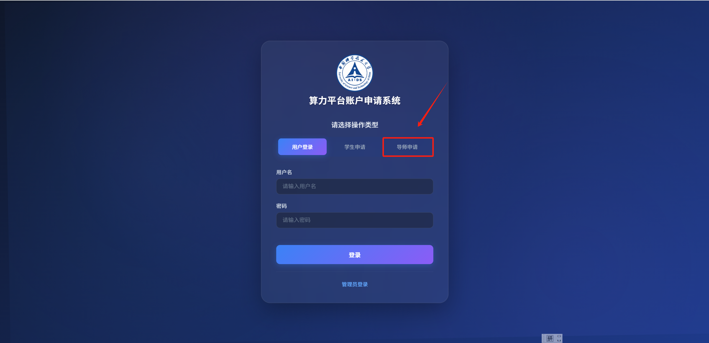
  2. 填写表单信息
  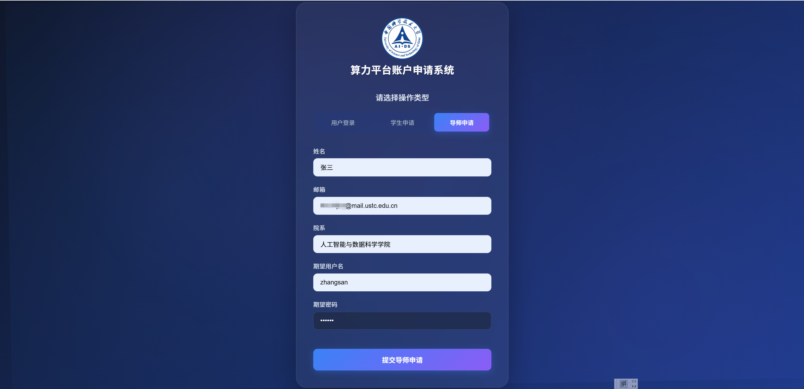
  3. 提交表单信息，等待系统管理员审核（≤1 个工作日）
  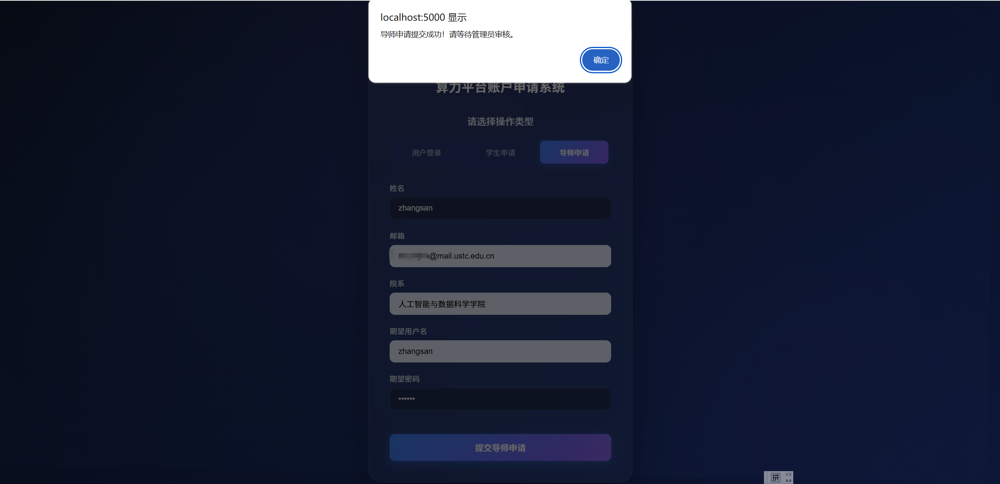
  4. 账户申请成功
  
  5. 导师登录系统审批学生申请流程：
    - 收到学生待审批邮件
  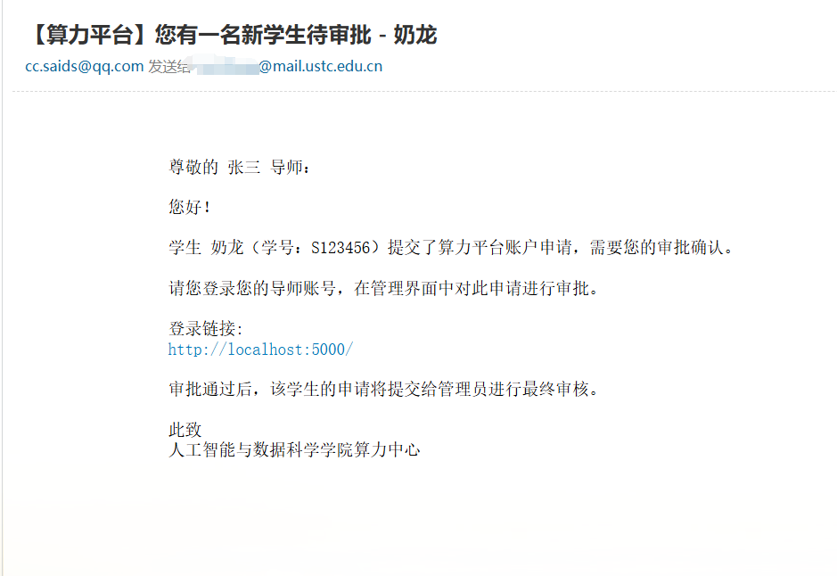
    - 用已注册用户名及密码登录系统
  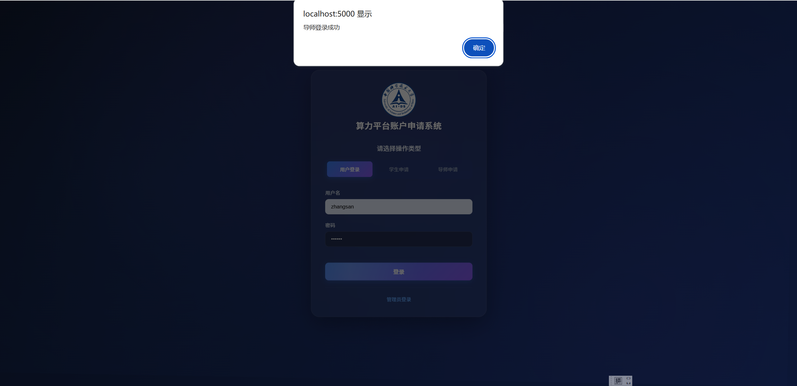
    - 审批学生申请
  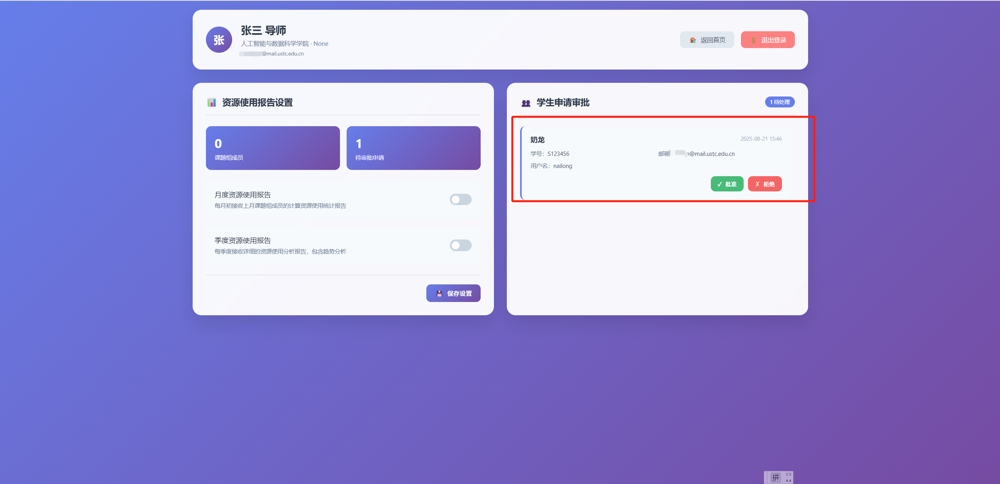

**学生注册**：

  1. 访问[在线申请系统]()，选择“学生申请”
  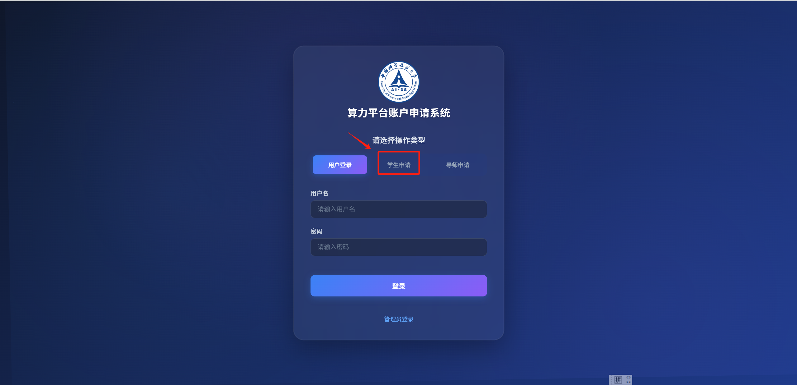
  2. 填写表单信息，提交后等待导师审批
  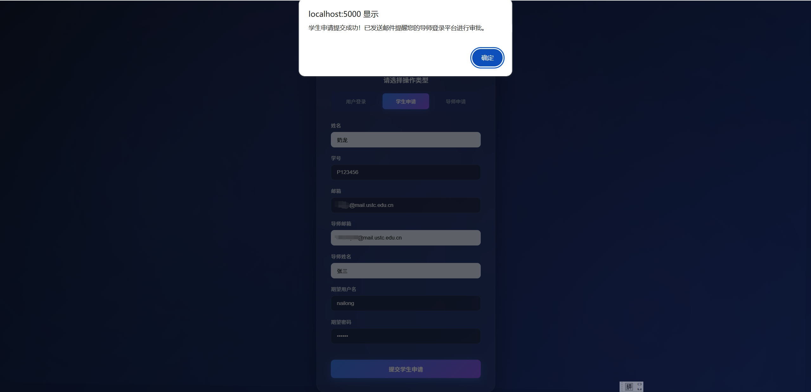
  3. 收到导师审批通过邮件
  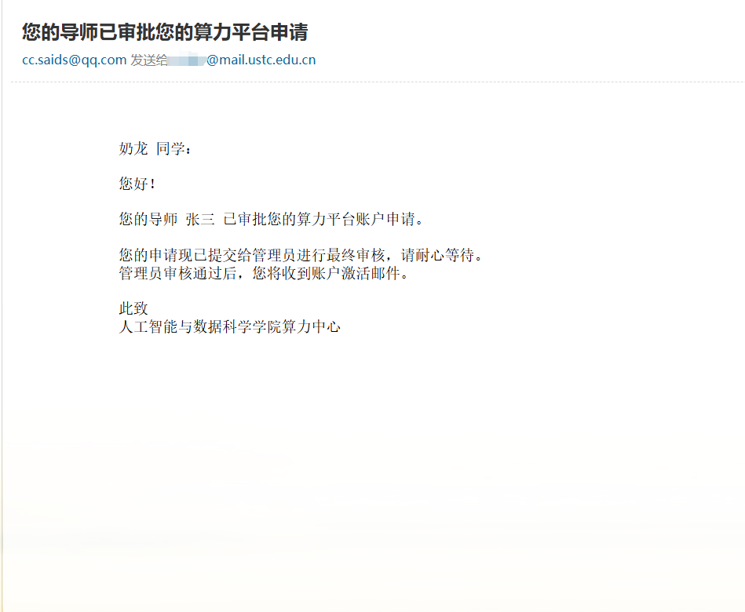
  4. 等待系统管理员审核（≤1 个工作日），审核通过后账户申请成功
  

### 账户申请流程
1. 导师申请流程
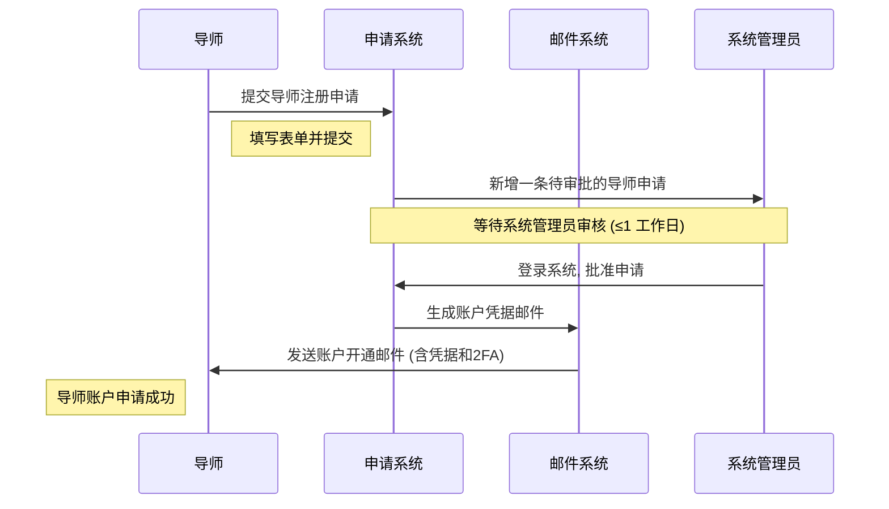

2. 学生申请流程

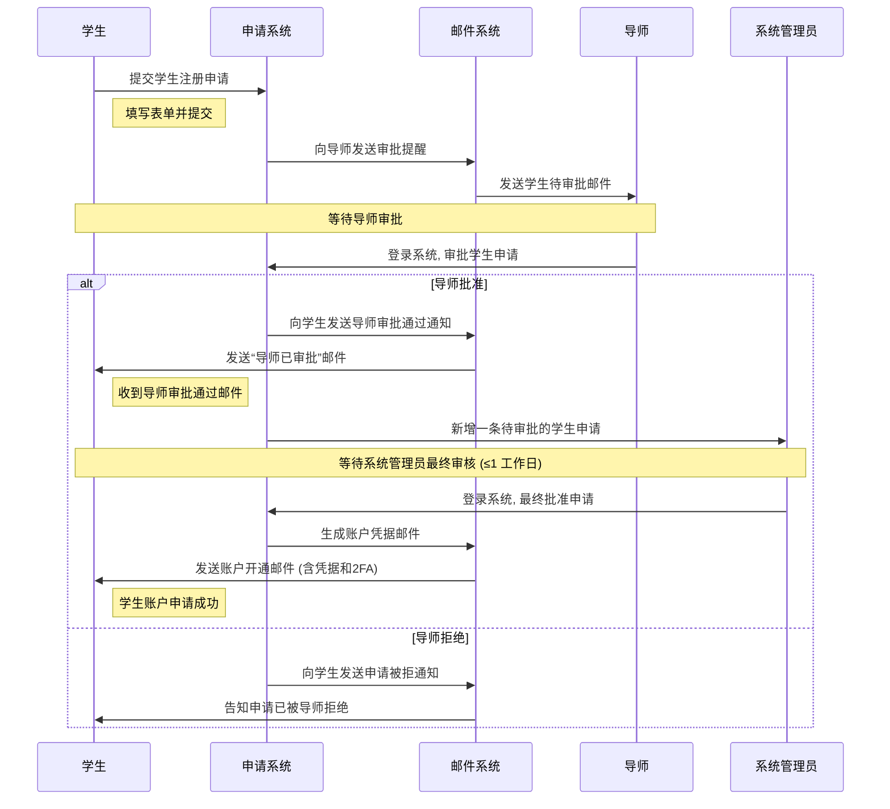

### 账户信息交付

审批通过后将通过邮件发送包含：

- 登录节点 IP
- 初始凭证：
    - 用户名
    - 随机初始密码
    - 2FA 密钥

