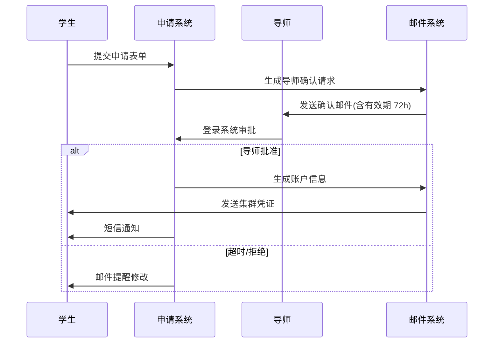

# 账号申请 {#account}

!!! warning "本文编写中"

本集群的用户需要通过[在线申请系统]()完成账户开通。学生作为申请人时与导师需分别完成注册和验证流程。

## 账户开通流程

### 用户注册阶段

**导师注册**（必需先行步骤）：

  1. 访问[在线申请系统]()
  2. 选择"导师身份注册"
  3. 提交表单信息及邮箱验证
  4. 等待系统管理员审核（≤1 个工作日）

**学生注册**：

  1. 访问[在线申请系统]()
  2. 提交表单信息及邮箱验证
  3. 绑定已注册的导师账户

### 账户申请流程

### 账户信息交付

审批通过后将通过邮件发送包含：

- 登录节点 IP
- 初始凭证：
    - 用户名
    - 随机初始密码
    - 2FA 密钥

【补充插图】账户在线申请系统表单界面
