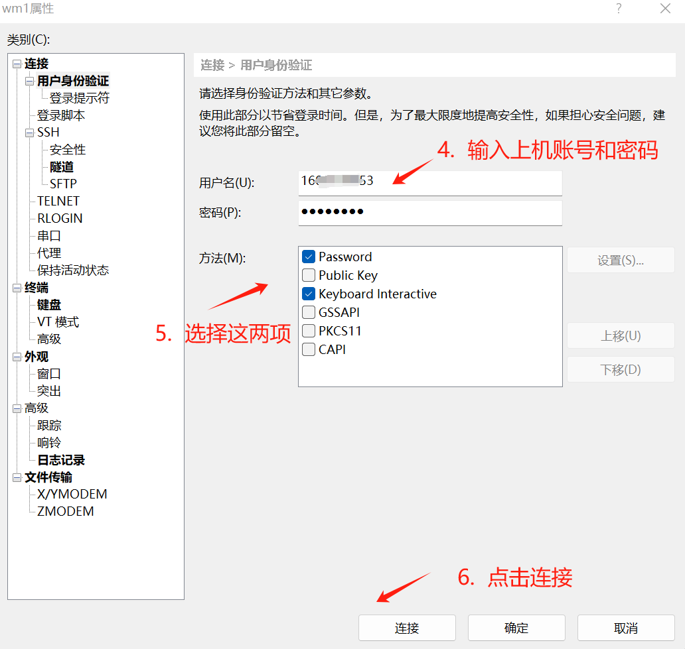

# 集群登录与文件传输

## 集群登录

集群的用户登录节点运行着 64 位 Ubuntu 24.04.3 LTS 操作系统。获取集群用户账号和认证凭据后，您可以通过 SSH (Secure Shell) 协议登录集群。

### Windows 用户登录方式

Windows 用户可选择以下任一支持 SSH 协议的客户端软件进行登录：

1. **[Xshell](https://www.xshell.com/zh/xshell/)** - 功能丰富的商业 SSH 客户端
2. **[Termius](https://termius.com/index.html)** - 为生产力和协作构建的现代 SSH 客户端
3. **[MobaXterm](https://mobaxterm.mobatek.net/)** - 适用于 Windows 的免费 Xserver 和选项卡式 SSH 客户端
4. **[PuTTY](https://www.chiark.greenend.org.uk/~sgtatham/putty/latest.html)** - 轻量级开源 SSH 客户端
5. **CMD/PowerShell** - Windows 命令行工具中内置了 SSH 相关命令

登录时会用到以下信息：  

- 用户名
- 集群域名 / IP 地址
- 账号密码
- 动态双因素认证（2FA）验证码

前三项信息和生成动态双因素认证（2FA）验证码所需的二维码均已包含在账号申请成功后发送的确认邮件内，请注意查收。

!!! tip "什么是 2FA 动态验证码？为什么我们要使用它？"
    双重验证（Two-Factor Authentication，简称 2FA） ，又称双因素认证，是一种安全保护方法。它要求用户在使用密码登录之外，再提供另一种形式的身份证明，才能成功访问账户。

    你可以把它想象成家门的两道锁：

    - 第一把锁：你知道的东西 - 你的密码（Password）。
    - 第二把锁：你拥有的东西 - 你的手机或安全密钥（Your Phone or Security Key）。

    即使黑客窃取了你的密码（第一把锁），他们没有你的手机（第二把锁），依然无法进入你的账户。这极大地增强了账户的安全性。任何有意保护个人和商业数据的组织或个人都应使用双因素认证（2FA）方法。这种安全措施将确保所有资产在未经适当身份验证的情况下都无法被访问。

    如何使用 2FA？在手机上安装 Google Authenticator 等认证器应用程序后，扫描账户申请确认邮件中的二维码。之后，认证器应用便会开始每 30 秒生成一个全新且仅可使用一次的 6 位数字验证码，即动态双因素认证（2FA）验证码。

下面以常用的 Xshell 软件为例，详细介绍使用图形用户界面客户端软件登录集群的步骤。打开 Xshell 软件，点击软件左上角新建会话（或在打开软件时弹出的窗口中点击新建会话）。

1. 在名称框中根据自己的习惯输入自定义名称
2. 输入集群地址
3. 点击左侧的 "用户身份验证"，进入"用户身份验证"菜单
4. 在 "用户身份验证" 里输入用户名和密码
5. 方法栏勾选 "Password" 和 "Keyboard Interactive" 这两项
6. 点击连接，并在弹出的窗口中输入动态双因素认证（2FA）验证码




图 1. Xshell 软件使用示例
{: .caption }

### macOS/Linux 用户登录方式

macOS 和 Linux 用户除了使用 Termius 等支持 SSH 协议的客户端软件外，还可以在终端进行 SSH 登录：

```shell
ssh username@cluster_address
```

首次连接时会提示确认主机密钥指纹，输入 yes 确认后继续。

Linux 操作系统的教程可以参考 USTCLUG 编写的 [《Linux 101》在线讲义](https://101.lug.ustc.edu.cn/)。

## 文件传输

### 使用 SFTP 客户端传输文件

推荐工具：

- **[Xftp](https://www.xshell.com/zh/xftp/)** (Windows)
- **[MobaXterm](https://mobaxterm.mobatek.net/)** (Windows)
- **[Termius](https://termius.com/index.html)**

### 命令行传输工具

(1) scp 命令：

```shell
# 上传文件到集群
scp /本地/文件 用户名@集群 IP:/远程/路径

# 从集群下载文件
scp 用户名@集群 IP:/远程/文件 /本地/路径
```

(2) rsync 命令：

```shell
# 同步本地目录到集群
rsync -avz /本地/目录/ 用户名@集群IP:/远程/目录/

# 从集群同步到本地
rsync -avz 用户名@集群IP:/远程/目录/ /本地/目录/
```

(3) rz/sz 命令：

```shell
# 上传文件
rz

# 下载文件
sz 文件名
```
