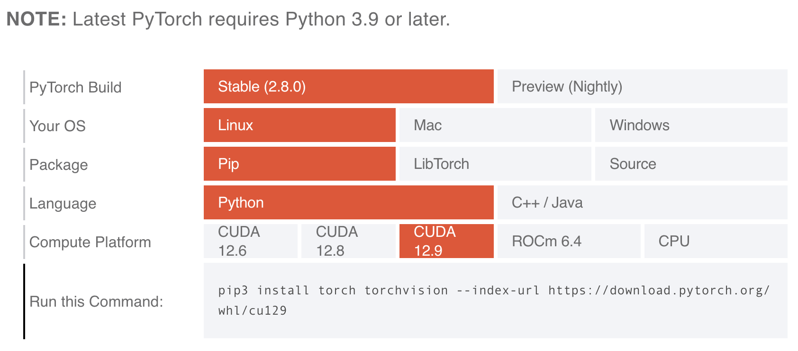

# 常用软件 {#software}

## PyTorch {#pytorch}

PyTorch 是一个基于 Python 的科学计算包，主要面向两类人群：

- 替代 NumPy 来使用 GPU 的强大计算能力
- 提供最大灵活性和速度的深度学习研究平台

作为当前最流行的深度学习框架之一，PyTorch 具有以下特点：

- **动态计算图**：更直观的调试和模型构建体验
- **强大的 GPU 加速**：完善的 CUDA 支持
- **丰富的生态系统**：torchvision、torchaudio 等扩展库
- **生产就绪**：通过 TorchScript 实现模型部署

### 基于 Conda 安装 PyTorch

```shell
# 加载 Anaconda 模块
ml Anaconda3/2025.06

# 创建名为 py312 的 conda 环境
conda create -n py312 python=3.12 -y

# 激活刚刚创建的名为 py312 的环境
conda activate py312
```



图 1. [PyTorch 官网](https://pytorch.org/get-started/locally/)提供的安装命令
{: .caption }

```shell
# 使用官网提供的命令安装 pytorch
pip3 install torch torchvision --index-url https://download.pytorch.org/whl/cu129
```

### 使用 PyTorch

这里给出一个简单的例子。

!!! note "示例代码文件：test.py"

    ```python
    import torch
    print(torch.cuda.is_available())
    print(torch.cuda.device_count())
    
    if torch.cuda.is_available():
        tensor_gpu = torch.rand(3, 3).cuda()
        print(tensor_gpu)
    ```

!!! note "作业提交脚本：submit_L40.sh"

    ```shell
    #!/bin/bash
    #SBATCH -J Pytorch_Test
    #SBATCH -p L40
    #SBATCH --gres=gpu:L40:7
    #SBATCH -o %j.out
    #SBATCH -e %j.err
    
    # 加载必要模块
    module purge
    module load Anaconda3
    
    source activate
    conda activate py312
    
    # 运行测试程序
    echo "开始 Pytorch 测试..."
    python test.py
    ```

使用 `sbatch submit_L40.sh` 命令提交作业后，可以在生成的 `.out` 文件中查看运行结果：

```shell
开始 Pytorch 测试...
True
7
tensor([[0.8080, 0.4660, 0.8196],
        [0.4500, 0.8270, 0.9302],
        [0.8101, 0.3835, 0.6736]], device='cuda:0')
```
