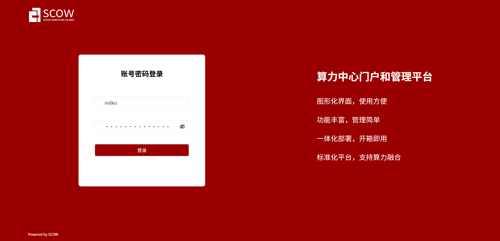
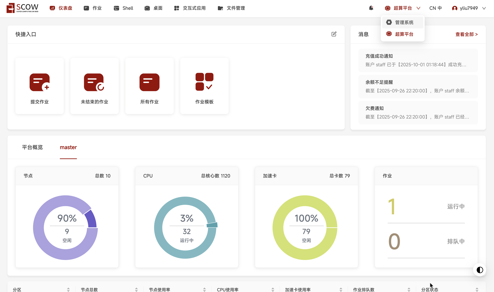
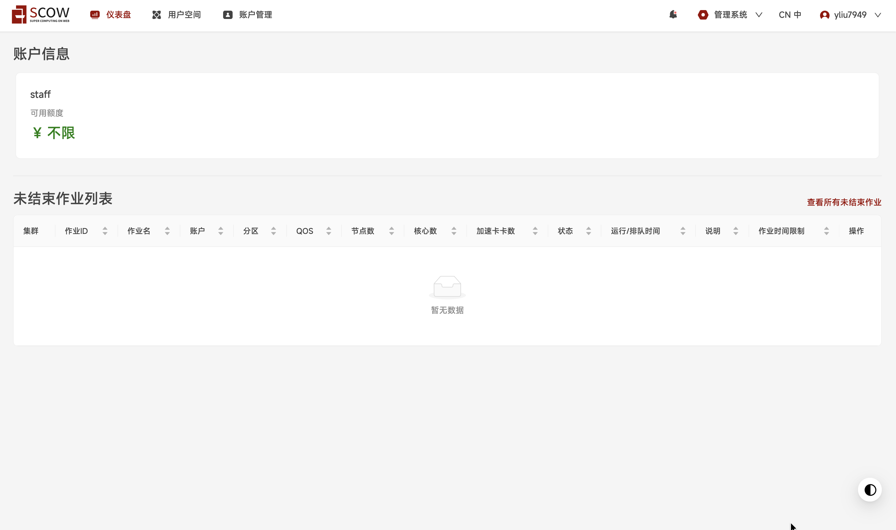
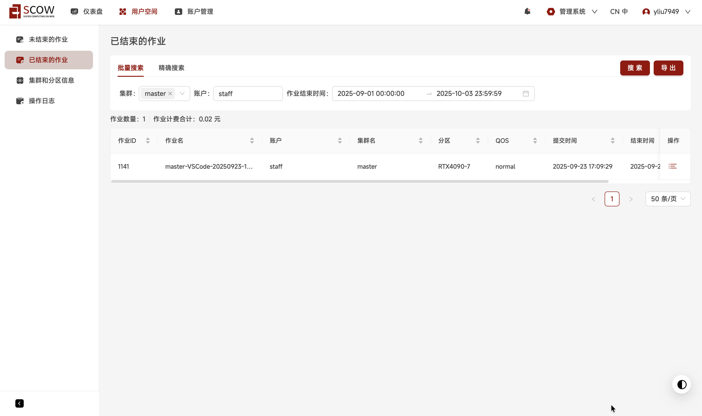

# 可视化平台 {#scow}

!!! warning "可视化平台暂未上线，敬请期待"

[SCOW（Super Computing On Web）](https://www.pkuscow.com/) 是国内首个开源的高性能计算门户和管理平台，在使用算力资源的时候，用户只需要一个浏览器即可管理集群上的文件、访问终端及桌面、提交和管理作业，以及执行带 GUI 的交互式任务。

## 用户登录

进入SCOW平台登录页面，使用SSH用户名和密码登录。

## 使用 shell
SCOW提供基于Web的Shell终端功能，无需安装SSH客户端即可直接访问登录节点。

- 在主页点击"Shell"选项进入终端界面。

- Shell页面，终端支持常见的Linux命令操作。

## 使用桌面功能
SCOW集成了远程桌面功能，支持图形化界面的交互式任务。

- 在主页点击"桌面"进入远程桌面管理界面。

- 选择桌面启动。

- 桌面界面。

## 作业管理
SCOW提供作业管理功能。

- 在主页点击作业，进入作业管理界面。

- 通过图形化界面配置作业参数，提交作业。

- 查看所有历史作业。

## 账户管理
SCOW提供账户管理页面，可查看账户可用额度和作业账单。

- 通过页面右上角切换按钮在超算平台和管理系统之间切换。

- 实时查看账户可用额度和资源使用情况。

- 查看作业计费合计。

